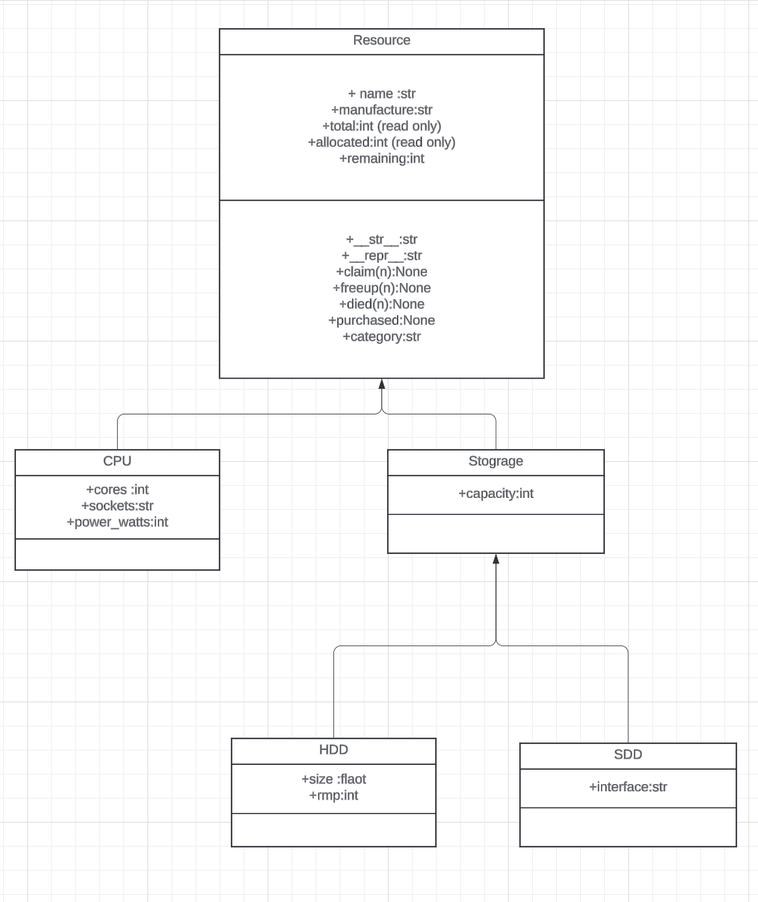

# Single Inheritance
You are writing an inventory application for a budding tech guy who has a video channel featuring computer builds. Basically they have a pool of inventory, (for example 5 x AMD Ryzen 2-2700 CPUs) that they use for builds. When they take a CPU from the pool, they will indicate this using the object that tracks that sepcific type of CPU. They may also purchase additional CPUs, or retire some (because they overclocked it too much and burnt them out!).

Technically we would want a database to back all this data, but here we're just going to build the classes we'll use while our program is running and not worry about retrieving or saving the state of the inventory.

The base class is going to be a general Resource. This class should provide functionality common to all the actual resources (CPU, GPU, Memory, HDD, SSD) - for this exercise we're only going to implement CPU, HDD and SSD.

It should provide this at a minimum:

- name : user-friendly name of resource instance (e.g. Intel Core i9-9900K)
- manufacturer - resource instance manufacturer (e.g. Nvidia)
- total : inventory total (how many are in the inventory pool)
- allocated : number allocated (how many are already in use)
- a __str__ representation that just returns the resource name
- a mode detailed __repr__ implementation
- claim(n) : method to take n resources from the pool (as long as inventory is available)
- freeup(n) : method to return n resources to the pool (e.g. disassembled some builds)
- died(n) : method to return and permanently remove inventory from the pool (e.g. they broke something) - as long as total available allows it
- purchased(n) - method to add inventory to the pool (e.g. they purchased a new CPU)
- category - computed property that returns a lower case version of the class name
 Next we are going to define child classes for each of CPU, HDD and SDD.

For the CPU class:

- cores (e.g. 8)
- socket (e.g. AM4)
- power_watts (e.g. 94)

For the HDD and SDD classes, we're going to create an intermediate class called **Storage** with these additional properties:

- capacity_GB (e.g. 120)
The HDD class extends Storage and has these additional properties:

- size (e.g. 2.5")
- rpm (e.g. 7000)
The SSD class extends Storage and has these additional properties:

- interface (e.g., PCIe NVMe 3.0 x4)
For all your classes, implements a full constructor that can be used to initialize all the properties, some form of validation on numeric types, as well as customized __repr__ as you see fit.

For the total and allocated values in the Resource init, think of the arguments there as the current total and allocated counts. Those total and allocated attributes should be private read-only properties, but they are modifiable through the various methods such as claim, return, died and purchased. Other attributes like name, manufacturer_name, etc should be read-only.

## class Diagrm

## area for improvements 
1. do more unittesting for 
   1. resource  class 
   2. Storage Class 
   3. CPU class 
   4. HDD class 
   5. SSD class
2. handle invalid inputs for other classes like we did for Resource
 for more information and the full implementation of this Project and other [check this repo](https://github.com/fbaptiste/python-deepdive/blob/main/Part%204/Section%2007%20-%20Project%203/Project%203%20-%20Description.ipynb)
3. more proper organization :_)
